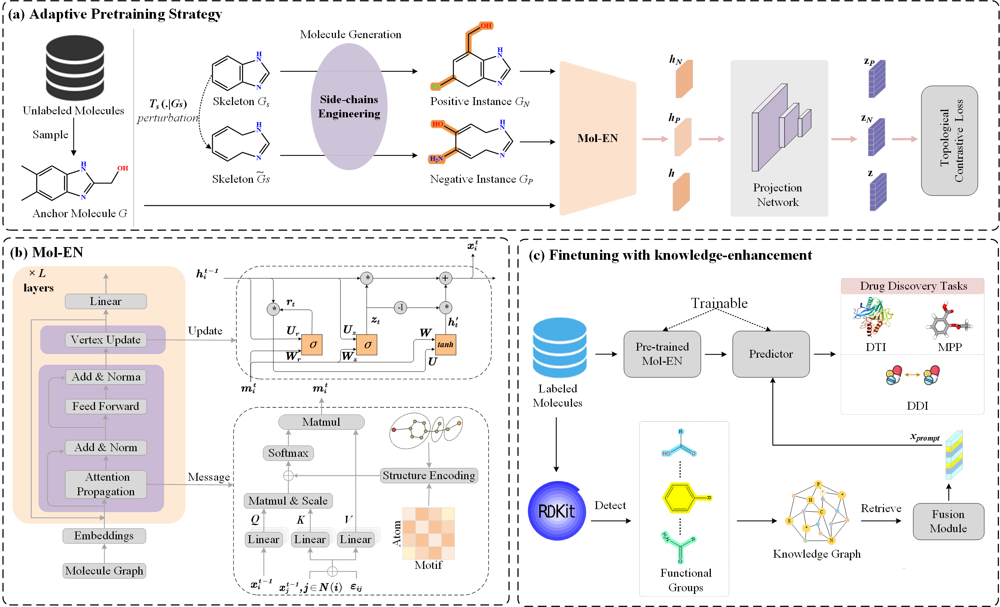

# MIFS: An adaptive multi-path information fusion self-supervised framework for drug discovery

Supporting Information for the paper "MIFS: An adaptive multi-path information fusion self-supervised framework for drug discovery"

MIFS IS an adaptive multi-path information fusion self-supervised framework, that learns molecular representations from large-scale unlabeled data to aid drug discovery. In MIFS, we innovatively design a dedicated molecular graph encoder, Mol-EN, which implements three pathways of information propagation: atom-to-atom, chemical bond-to-atom, and substructure-to-atom. Further, a novel adaptive pre-training strategy based on the molecular scaffolds is devised to pre-train Mol-EN on 11 million unlabeled molecules.

## Dataset
All data used in this paper are uploaded and can be accessed . 

- DTI datasets: Human, C.elegans
- DDI datasets: DrugBank, BIOSNAP
- MPP datasets:  Lipo, ESOL, and FreeSolv, BACE, BBBP, Tox21, ToxCast, SIDER, and ClinTox.

The core code of MIFS will be published when the review of the paper is complete. 

